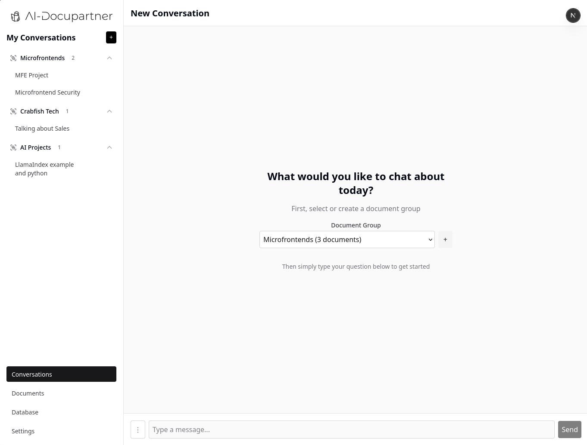
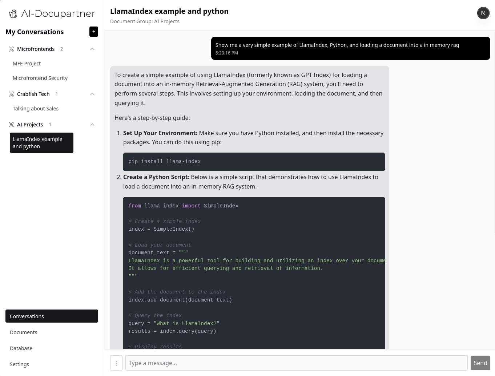
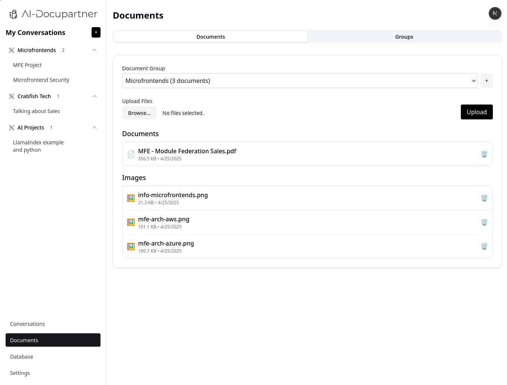
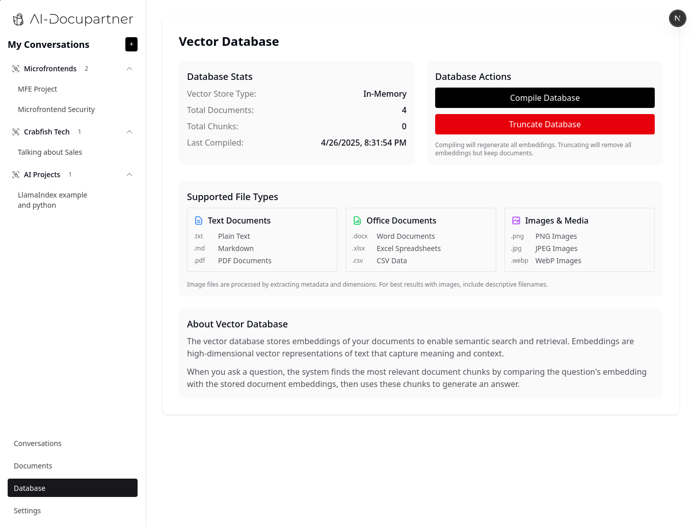
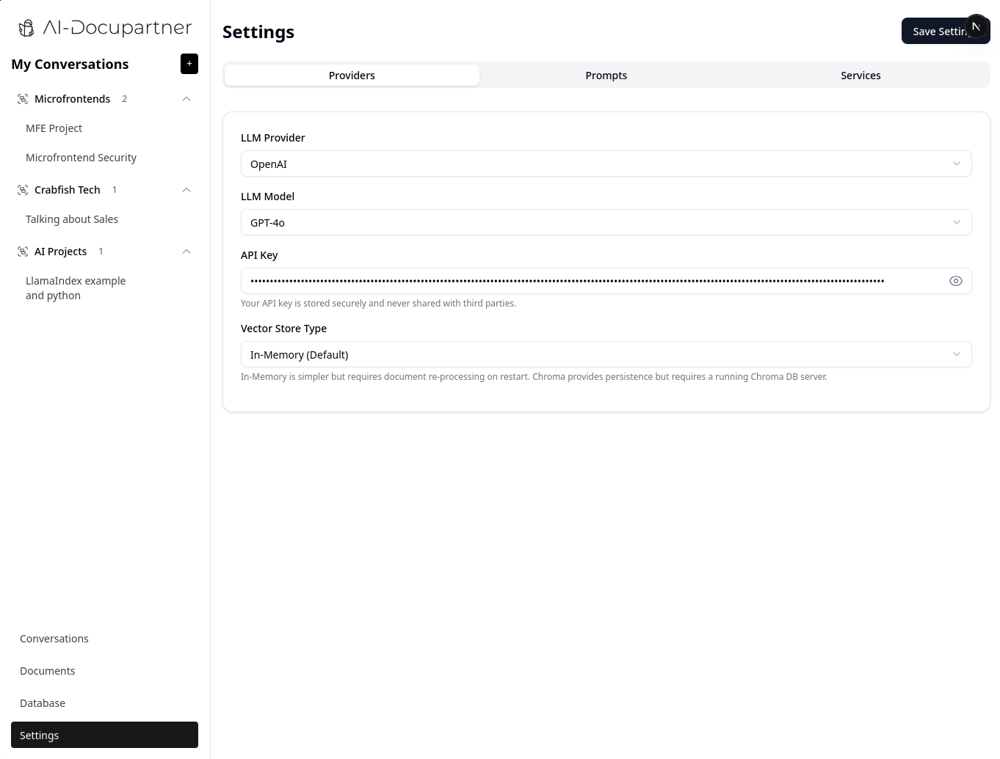
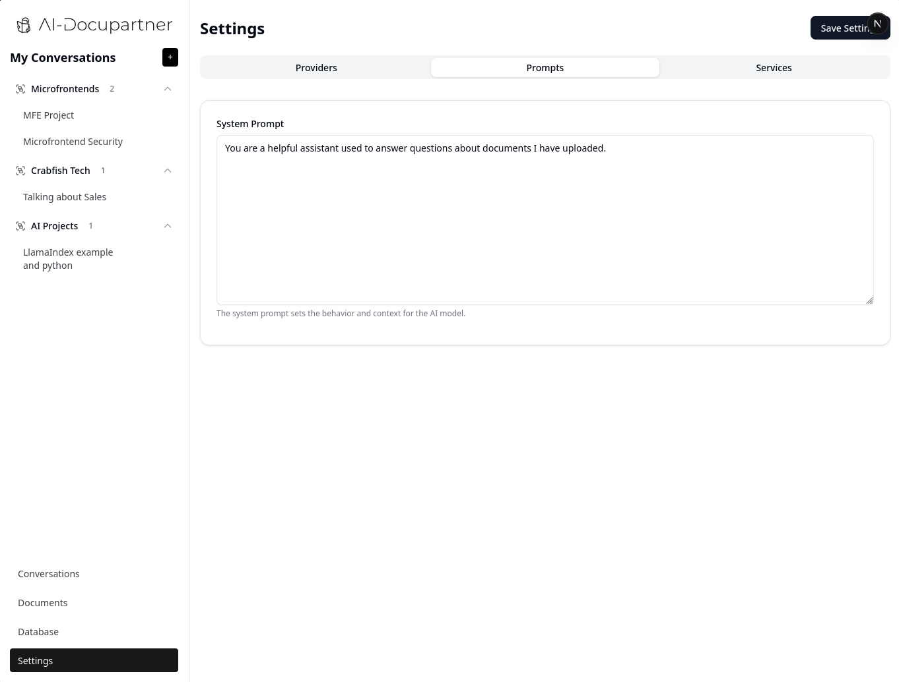
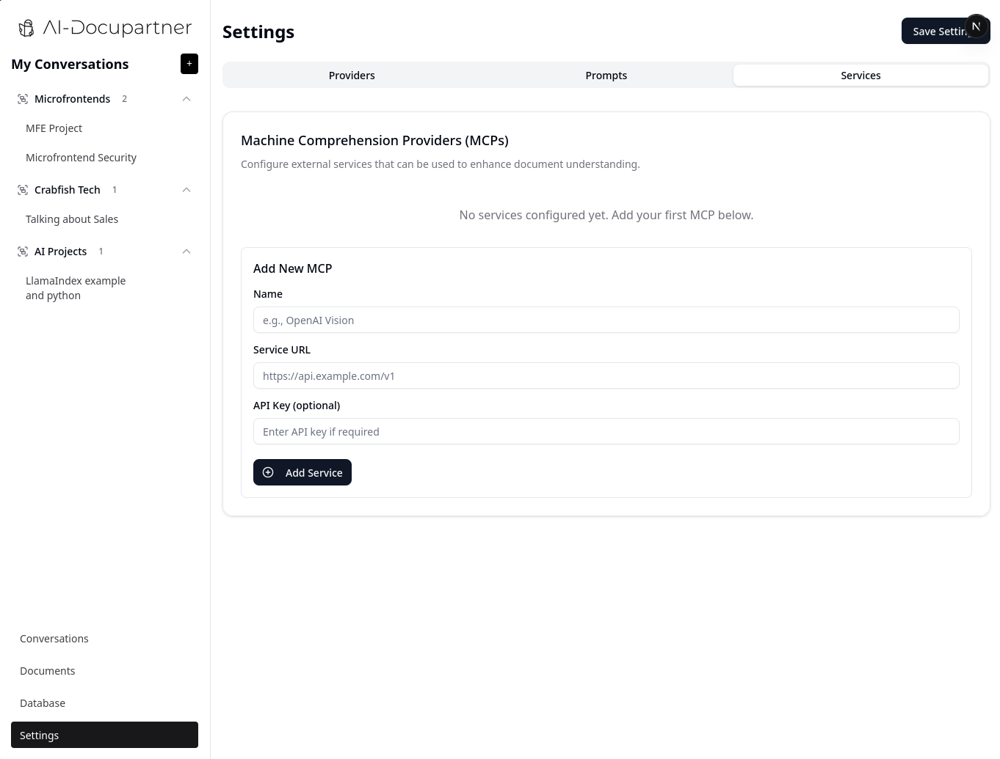
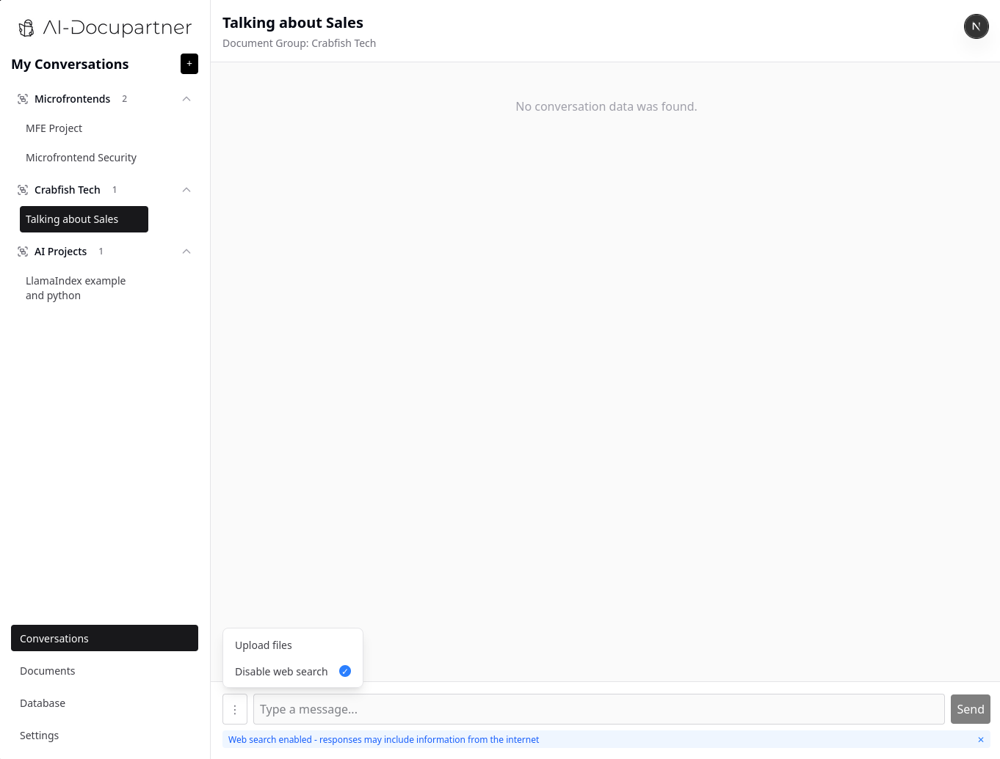

# AI DocuPartner

AI DocuPartner is a document management system with AI-powered conversation capabilities. It allows you to upload, organize, and query documents using large language models (LLMs) like OpenAI and Anthropic.

## Features

- **Document Management**: Upload, organize, and delete documents
- **Document Groups**: Organize documents into custom groups
- **Conversations**: Chat with AI about your documents
- **Web Search**: Enhance AI responses with web search capabilities
- **Multiple LLM Support**: Use OpenAI or Anthropic as your AI provider
- **Customizable Settings**: Configure your API keys and system prompts

## Tech Stack

- **Frontend**: Next.js, React, Tailwind CSS
- **Backend**: Next.js API Routes
- **AI Integration**: LangChain, OpenAI API, Anthropic API
- **File Storage**: Local file system

## Getting Started

First, install the dependencies:

```bash
npm install
```

Then, run the development server:

```bash
npm run dev
```

Open [http://localhost:3000](http://localhost:3000) with your browser to see the application.

## Environment Variables

Create a `.env.local` file in the root directory with the following variables:

```
OPENAI_API_KEY=your_openai_api_key
ANTHROPIC_API_KEY=your_anthropic_api_key
```

## Project Structure

- `/app`: Next.js app directory with pages and API routes
- `/components`: Reusable React components
- `/files`: Local storage for uploaded files and conversation data
- `/public`: Static assets

## API Routes

- `/api/conversation`: Manage conversations
- `/api/document-groups`: Manage document groups
- `/api/files`: List and delete files
- `/api/upload`: Upload files
- `/api/rag`: RAG (Retrieval Augmented Generation) endpoints
- `/api/web-search`: Web search integration

## Screenshots

Here are some screenshots of the application:

### Conversation Interface with Markdown Support


### Code Syntax Highlighting


### Document Upload


### Document Groups


### Document Management


### Document Details


### Web Search Integration


### Settings Page


## License

MIT